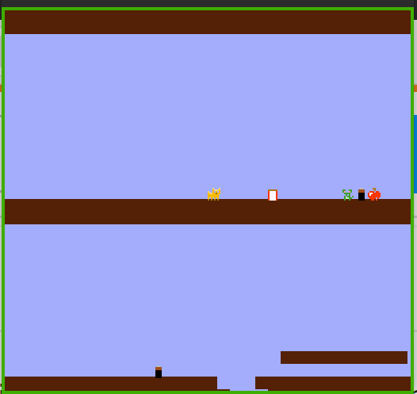

# Bomb A Mouse

Author: Yuan Meng

Design: A 2-D level game where the cat needs to find a way to kill a mouse on the third floor

Screen Shot:

How Your Asset Pipeline Works:

Asset Pipeline works as follows:
1. From authoring to runtime format
    - Draw pixel art using GIMP, as I'm not a art person. Most sprites are from [reddit](https://www.reddit.com/r/PixelArt/comments/kzqite/oc_cute_8x8_pixel_art_with_max_3_colours_per/).
    - export GIMP xcf into png
    - Use a Python script to read the PNG.
        - For sprite png. Each extract a pelette and a tile, and its type.
        - For Backgroun png. Extract a palette and 64*60 tiles. Also generate a data structure that indicates this location is wall(where the main sprite will have collision)
        - Generate a runtime file indicating where the items are in the level, and what type are they.
        - Generate two text background, used in showing you win or lose.

        - In the end there will be six runtime files. one for palette,one for sprites,three for different backgrounds and one for item locations.
            - Files are written in the format supported by the helper function read_chunk
2. Read runtime format
    - Define many struct that has the same format(in binary) as the runtime file. Use read_chunk to read the file into these structs.

How To Play:

| keyboard | description |
|---|---|
| `→` | move right |
|`←`|move left|
|`↑`|jump|
|`↓`|throw a bomb(if you have one)|
|`space`| elevate without collision detection(in case get stuck) |

This game was built with [NEST](NEST.md).

